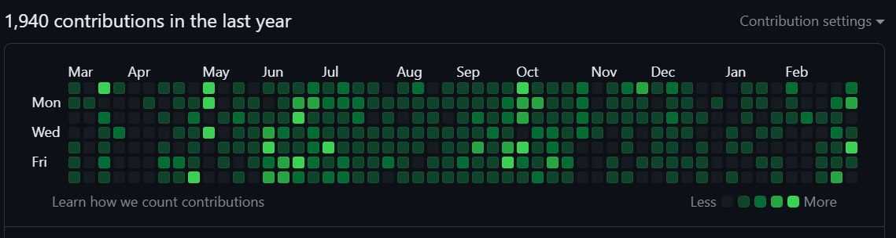

# One year of full-time work on personal projects since leaving Google in March of 2023

I worked at Google for a bit over 12 years.

On March 17, 2023 I left Google and decided to see what I could do in a year of working full-time on my own projects.

Here is what I accomplished, in no particular order:

- [Hancho](https://github.com/aappleby/hancho)
  - Created Hancho, my "simple and pleasant" build system.
  - One file of Python, copy-paste it into your repo and go.
  - Fast parallel builds inspired by Ninja, simple syntax inspired by Bazel and Python's f-strings.
  - Powerful templating system via abuse of Python's eval() and Javascript-style prototypal object inheritance.
- [Matcheroni & Parseroni](https://github.com/aappleby/matcheroni)
  - Created Matcheroni and Parseroni, my lexing and parsing toolkit that uses C++20 templates to generate recursive descent parsers at compile time.
  - Contains a full C99 parser as an 'example' :D
  - Also a conformant JSON parser as another example
  - The generated debug symbols are horrific, but the compiled code is small and fast.
  - Documentation and tutorial links are broken :/
- [Metron](https://github.com/aappleby/metron)
  - Ported my C++-to-SystemVerilog translator Metron to use Matcheroni and Parseroni for parsing C++.
  - Documentation has rotted a bit but the test suites still pass.
- [Pinwheel](https://github.com/aappleby/pinwheel)
  - Redesigned Pinwheel, my RISC-V microcontroller core, so that it runs 2 hardware threads (harts) at once interleaved.
  - The two harts can be swapped between N 'ready to run' threads in a single instruction.
  - Threads can read/write each other's register files, single step each other - you can in principle have a debug interface running in one hart while the other hart is running an application (implementation TBD) 
  - Passes all the RV32I tests, getting it working again on a FPGA is on my to-do list (requires more work regarding block ram inference)
- [PicoRVD](https://github.com/aappleby/picorvd)
  - Reverse engineered the debug protocol for the 10-cent 'CH32V003' RISC-V microcontroller.
  - Wrote a GDB-compatible debug probe inteface for it that runs on the Raspberry Pi Pico
  - Can flash binaries, single-step, set arbitrary numbers of breakpoints.
  - Faster than the manufacturer-provided debug interface.
  - The debugging code was later used by cnlohr@ to add debug support to his [ch32v003fun](https://github.com/cnlohr/ch32v003fun) project
- [Wideboard](https://github.com/aappleby/wideboard)
  - Ported Wideboard to Typescript, which was a surprisingly pleasant experience and far easier than using Google's Closure compiler.
  - Wideboard is a proof-of-concept text renderer that can handle _huge_ amounts of text at once
  - Wideboard can display the entire source of the Linux kernel in a web browser tab.
- [gbmicrotest](https://github.com/aappleby/gbmicrotest)
  - Turned my collection of tiny Gameboy hardware tests into a standalone repo
- [metronica](https://github.com/aappleby/metronica)
  - Pulled out just the audio portion of my game boy emulator to make Metronica, a tool for replaying Game Boy audio dumps.
  - It works but I never actually used it to play anything other than the "Link's Awakening" title screen music. :D
- [plait](https://github.com/aappleby/plait)
  - Pulled my circuit graph visualization tool Plait out into its own repo
  - It has code rotted and is not very usable
- [repo](https://github.com/aappleby/repo)
  - Created a meta-repo for all my projects and wrote some Python tools to manage it
  - My personal projects contain a symlinks/ directory that point to other projects in the meta-repo
  - This seems to be a better way than git submodules for handling inter-project dependencies, at the cost of having dependencies spread horizontally across the meta-repo directory instead of nested under a parent repo.
